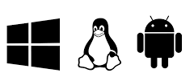
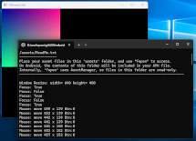
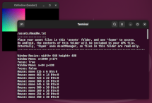
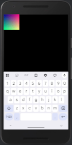

# GWindow

**GWindow** is a lightweight, cross-platform C++ window creation library for building graphical applications, inspired by GLFW. It provides a clean and consistent API for input handling (keyboard, mouse, touchscreen, and gamepads) across **Windows**, **Linux**, and **Android**.

GWindow is designed for **Vulkan**, OpenGL, OpenGL ES or even software rendering.  Distributed as a single-header (stb-style) library, it emphasizes minimal dependencies, fast builds, and tiny binaries.

 

  

---

## ✨ Features:

- 🪟 Native window creation on **Windows**, **Linux**, and **Android**
- 🖥️ Windowed and fullscreen modes
- ⌨️ Input handling: keyboard, mouse, touchscreen, gamepads
- 🖱️ Mouse cursor icons support (pointer/caret/spinner/etc.) — (used by **ImGui**)
- 📋 Clipboard text copy/paste
- 🖌️ HiDPI/desktop scaling support
- 🖼️ CPU software rendering with `showImage()`
- 🎮 GPU acceleration with Vulkan, or OpenGL(ES)
- ⚡ Minimal dependencies, fast builds, tiny binaries (~50KB on Linux)

## 📱 Android extras:

- 💻 Pure C++ apps — no need for Java or Kotlin
- 📂 fopen() transparently routed to APK assets (works with stb_image.h, etc.)
- 🐞 printf() output redirected to logcat, for debugging.
- ⌨️ Show/hide the on-screen keyboard.

---

## 🚀 Getting Started

### Prerequisites

For Windows and Linux builds:  

- **QtCreator** recommended (MSVC++ also works.)
- **C++17** or later (e.g. MSVC, GCC, Clang)
- **CMake** 3.22.1+

For Android builds:

- **Android Studio** recommended.
- **Android NDK** (recommended: 21+)
- **Gradle + CMake**

### Installation

1. Windows and Android: Uses only system APIs — no extra dependencies required.

2. Linux: Optional dependencies for clipboard and mouse cursor support.
   
   - If not needed, optional features can be disabled in config.h
   - Some build-time -dev packages are required (C header files)
   - Run `dependencies.sh` to install them

### Tests

There are two example test apps in the `tests/` directory.  
See [INTEGRATION.md](tests/INTEGRATION.md) for details.

---

## 📝 Example Usage

This example uses the callback-based paradigm with `pollEvents()`:

```cpp
#define GWINDOW_IMPLEMENTATION
#include "GWindow.h" // or "Window.h" for modular version

const char* type[] {"up  ", "down", "move"};  // Action types for mouse, keyboard and touch-screen.

class MyWindow : public GWindow {
    // EVENT HANDLERS:
    void onMouse(eAction action, int16_t x, int16_t y, uint8_t btn) { printf("Mouse: %s %d x %d Btn:%d\n", type[action], x, y, btn); }
    void onTouch(eAction action, float x, float y, uint8_t id) { printf("Touch: %s %.2f x %.2f id:%d\n", type[action], x, y, id); }
    void onKey  (eAction action, eKeycode keycode)           { printf("Key: %s keycode:%d\n", type[action], keycode); }
    void onText (const char *str)                            { printf("Text: '%s'\n", str); }
    void onMove (int16_t x, int16_t y)                       { printf("Window Move: x=%d y=%d\n", x, y); }
    void onFocus(bool hasFocus)                              { printf("Window Focus: %s\n", hasFocus ? "True" : "False"); }
    void onResize(uint16_t width, uint16_t height)           { printf("Window Resize: width=%4d height=%4d\n", width, height); }
    void onGPadConnect(uint8_t pad, bool active)             { printf("Gamepad %d %s\n", pad, active?"connected":"disconnected"); }
    void onGPadButton (uint8_t pad, uint8_t btn, bool down)  { printf("Gamepad %d button %d %s\n", pad, btn, down?"down":"up"); }
    void onGPadAxis   (uint8_t pad, uint8_t axis, float val) { printf("Gamepad %d axis %d : %.2f\n", pad, axis, val); }
    void onClose()                                           { printf("Window Closing.\n"); }
    void onFrame()                                           {/*called per frame*/}
};

int main(int argc, char *argv[]) {
    MyWindow window;                // Create a window
    window.setTitle("GWindow");     // Set the window title
    window.setSize(640, 480);       // Set the window size (Desktop)
    window.showKeyboard(true);      // Show soft-keyboard  (Android)

    while(window.pollEvents()) {    // Main loop, runs until window closed.
        // Add rendering code here. (eg. Vulkan / OpenGL / etc.)
    }
    return 0;
}
```

See `API-Reference.md` for other event-handling paradigms (polling, `Run()`).

---

## 📚 Documentation

- [Integration](tests/INTEGRATION.md) : How to integrate GWindow with your renderer.
- [API Reference](docs/API-Reference.md) : Detailed API list and method descriptions.
- [Developer guide](docs/Developer-guide.md): Extending GWindow for new platforms. 
- [Gamepads](extras/gamepads/README.md): Generating the Gamepad Mappings lookup table.
- [Vulkan](extras/for%20Vulkan/README.md): Integrating with Vulkan.
- [Dear ImGui](extras/for%20Dear%20ImGui/README.md): Integrating with Dear ImGui.

---

## 📜 License

MIT License (see `LICENSE` file).

---

## 📌 Notes

- Place asset files in `/assets/` for inclusion in the Android APK.
- See `docs/todo.txt` for planned features (e.g., Wayland support).